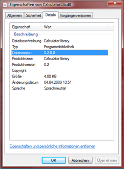

# Modifying AssemblyInfo and File Version via FAKE

In this article the AssemblyInfo task is used in order to set a specific version info to .NET assemblies.

If you succed with the [Getting Started tutorial](gettingstarted.html), then you just have to modify your *BuildApp* target to the following:

	Target "BuildApp" (fun _ ->
		AssemblyInfo 
		  (fun p -> 
			{p with
			  CodeLanguage = CSharp;
			  AssemblyVersion = version;
			  AssemblyTitle = "Calculator Command line tool";
			  AssemblyDescription = "Sample project for FAKE - F# MAKE";
			  Guid = "A539B42C-CB9F-4a23-8E57-AF4E7CEE5BAA";
			  OutputFileName = @".\src\app\Calculator\Properties\AssemblyInfo.cs"})
          
		AssemblyInfo 
		  (fun p -> 
			{p with
			  CodeLanguage = CSharp;
			  AssemblyVersion = version;
			  AssemblyTitle = "Calculator library";
			  AssemblyDescription = "Sample project for FAKE - F# MAKE";
			  Guid = "EE5621DB-B86B-44eb-987F-9C94BCC98441";
			  OutputFileName = @".\src\app\CalculatorLib\Properties\AssemblyInfo.cs"})  

		MSBuildRelease buildDir "Build" appReferences
		  |> Log "AppBuild-Output: "
	)

As you can see modifying an AssemblyInfo.cs file is pretty easy with FAKE. The AssemblyInfo task works for C#, VB.Net and F#. 

## Setting the version no.

The version parameter can be declared as a property or fetched from a build server like TeamCity:

	let version =
	  match buildServer with
	  | TeamCity -> buildVersion
	  | _ -> "0.2"

