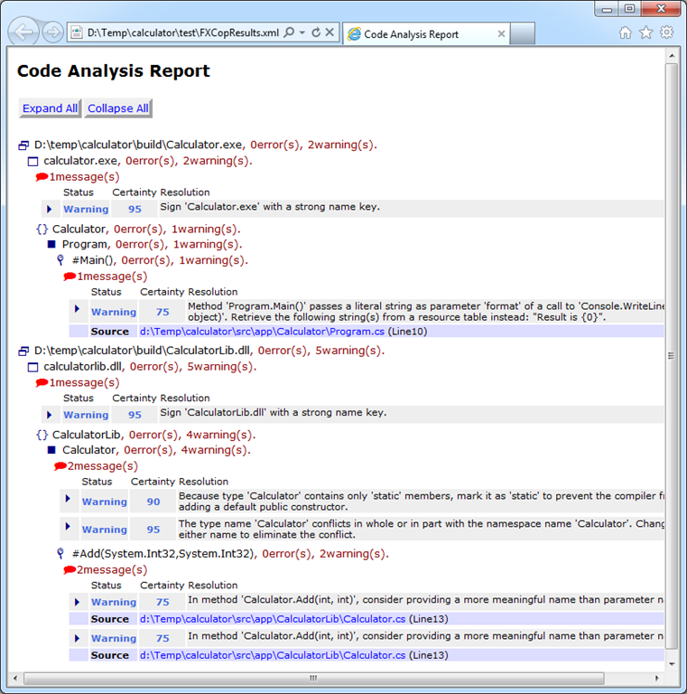

# Adding FxCop to a FAKE build script

This article is an extension to the [getting started guide](gettingstarted.html). You will improve the same Calculator sample with a task for [FxCop](http://msdn2.microsoft.com/en-us/library/bb429476.aspx).

## Setting up FxCop

Open *build.fsx* from your Calculator sample folder and add a new target *FxCop* to the targets section:

	Target "FxCop" (fun () ->
	  let assemblies = 
		!+ (buildDir + @"\**\*.dll") 
		  ++ (buildDir + @"\**\*.exe") 
		  |> Scan  

	  FxCop 
		(fun p -> 
		  {p with 
			// override default parameters
			ReportFileName = testDir + "FXCopResults.xml";
			ToolPath = "FxCopCmd.exe"})
		assemblies 
	)

In the dependencies section modify the build order to:

	"Clean"
	  ==> "BuildApp"
	  ==> "FxCop"
	  ==> "BuildTest"
	  ==> "Test"
	  ==> "Deploy"
	  ==> "Default"

That's it. If you run your build script you will get new *.xml file in the *./test* folder:

## Letting the build fail

If you want to let the build fail in the case that FxCop reports any errors or warnings you can use the *FailOnError* parameter:

	Target "FxCop" (fun () ->
	  let assemblies = 
		!+ (buildDir + @"\**\*.dll") 
		  ++ (buildDir + @"\**\*.exe") 
		  |> Scan  

	  FxCop 
		(fun p -> 
		  {p with 
			// override default parameters
			ReportFileName = testDir + "FXCopResults.xml";
			FailOnError = FxCopErrorLevel.CriticalWarning;
			ToolPath = "FxCopCmd.exe"})
		assemblies 

If you activate this option FxCop errors will cause your build to fail. Possible values are:

* FxCopErrorLevel.Warning
* FxCopErrorLevel.CriticalWarning
* FxCopErrorLevel.Error
* FxCopErrorLevel.CriticalError
* FxCopErrorLevel.ToolError
* FxCopErrorLevel.DontFailBuild

The values are cummulative. If you choose *FxCopErrorLevel.CriticalWarning* the build will fail for critical warnings, errors, critical errors and FxCop tool errors but not for simple warnings. The default is *FxCopErrorLevel.DontFailBuild*.