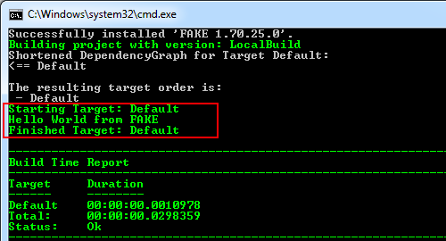

# Getting started with FAKE - F# Make

In this tutorial you will learn how to set up a complete build infrastructure with "FAKE - F# Make". This includes:

* how to install the latest FAKE version
* how to automatically compile your C# or F# projects
* how to automatically resolve nuget dependencies
* how to automatically run NUnit tests on your projects
* how to zip the output to a deployment folder

## Install the F# compiler

"FAKE - F# Make" is completely written in F# and all build scripts will also be written in F#, but this doesn't imply that you have to learn programming in F#. In fact the "FAKE - F# Make" syntax is hopefully very easy to learn.

## Download Calculator Sample

Now download the latest [FAKE-Calculator.zip](https://github.com/fsharp/FAKE/archive/Calculator.zip) from the [FAKE project site](https://github.com/fsharp/FAKE). This sample includes 3 tiny projects and has basically the following structure:

* src\app
	* Calculator (command line)
	* CalculatorLib (class library)
* src\test
	* Test.CalculatorLib
* tools
	* NUnit
	* FxCop
* build.bat
* build.fsx
* completeBuild.bat
* completeBuild.fsx
* Calculator.sln

## Getting "FAKE - F# Make" started

In the root of the project you will find a build.bat file:

    [lang=batchfile]
	@echo off
	cls
	"tools\nuget\nuget.exe" "install" "FAKE" "-OutputDirectory" "tools" "-ExcludeVersion"
	"tools\FAKE\tools\Fake.exe" build.fsx
	pause

If you run this batch file from the command line then the latest FAKE version will be [downloaded via nuget](http://nuget.org/packages/FAKE/) and your first FAKE script (build.fsx) will be executed. If everything works fine you will get the following output:

Now open the *build.fsx* in Visual Studio or any text editor. It should look like this:

	// include Fake lib
	#r @"tools\FAKE\tools\FakeLib.dll"
	open Fake 

	// Default target
	Target "Default" (fun _ ->
		trace "Hello World from FAKE"
	)

	// start build
	Run "Default"

As you can see the code is really simple. The first line includes the FAKE library and is vital for all FAKE build scripts.

After this header the Default target is defined. A target definition contains two important parts. The first is the name of the target (here "Default") and the second is an action (here a simple trace of "Hello world").

The last line runs the "Default" target - which means it executes the defined action of the target.

## Cleaning the last build output

A typical first step in most build scenarios is to clean the output of the last build. We can achieve this by modifying the *build.fsx* to the following:

	// include Fake lib
	#r @"tools\FAKE\tools\FakeLib.dll"
	open Fake

	// Properties
	let buildDir = @".\build\"

	// Targets
	Target "Clean" (fun _ ->
		CleanDir buildDir
	)

	Target "Default" (fun _ ->
		trace "Hello World from FAKE"
	)

	// Dependencies
	"Clean" 
	  ==> "Default"

	// start build
	Run "Default"

Read the [full acticle](http://www.navision-blog.de/2009/04/01/getting-started-with-fake-a-f-sharp-make-tool/).