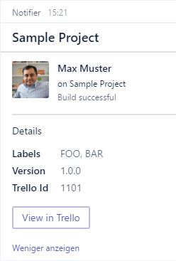

# Sending Notifications to a Microsoft Teams channel

In this article you will learn how to create a Office 365 webhook integration on a MS Teams channel and send a notification to it. This article assumes that you already have a Microsoft Teams team and channel setup.

## Adding a Webhook Integration to a Channel

Follow the [instructions](https://msdn.microsoft.com/en-us/microsoft-teams/connectors) for setting up a webhook connector to your channel. When finished, you should have a Webhook URL that looks like "https://outlook.office.com/webhook/some-random-text/IncomingWebhook/some/random/text".

## Sending a Notification to the Webhook

    // The webhook URL from the integration you set up
    let webhookUrl = "https://outlook.office.com/webhook/some-random-text/IncomingWebhook/some/random/text"

    let imageUrl = sprintf "https://connectorsdemo.azurewebsites.net/images/%s" 

    let notification p =
        { p with
            Summary = Some "Max Muster ran a build"
            Title = Some "Sample Project"
            Sections =
               [ { SectionDefaults with
                     ActivityTitle = Some "Max Muster"
                     ActivitySubtitle = Some "on Sample Project"
                     ActivityText = Some "Build successful!"
                     ActivityImage =
                        imageUrl "MSC12_Oscar_002.jpg"
                        |> ImageUri.FromUrl
                        |> Some
                 }
                 { SectionDefaults with
                     Title = Some "Details"
                     Facts = [ { Name = "Labels"; Value = "FOO, BAR" }
                               { Name = "Version"; Value = "1.0.0" }
                               { Name = "Trello Id"; Value = "1101" } ]
                 }
               ]
            PotentialActions =
               [
                 {
                   Name = "View in Trello"
                   Target = System.Uri("https://trello.com/c/1101/")
                 }
               ]
        }

    Office365Notification webhookUrl notification |> ignore

The result should look something like this:

For additional information on the parameters, check out the [Office 356 Connectors API Reference](https://dev.outlook.com/connectors/reference)
