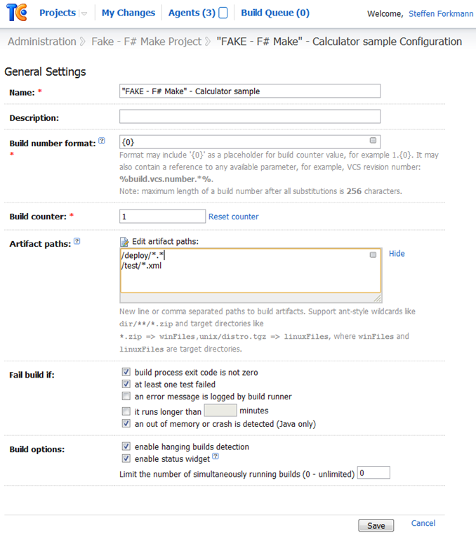
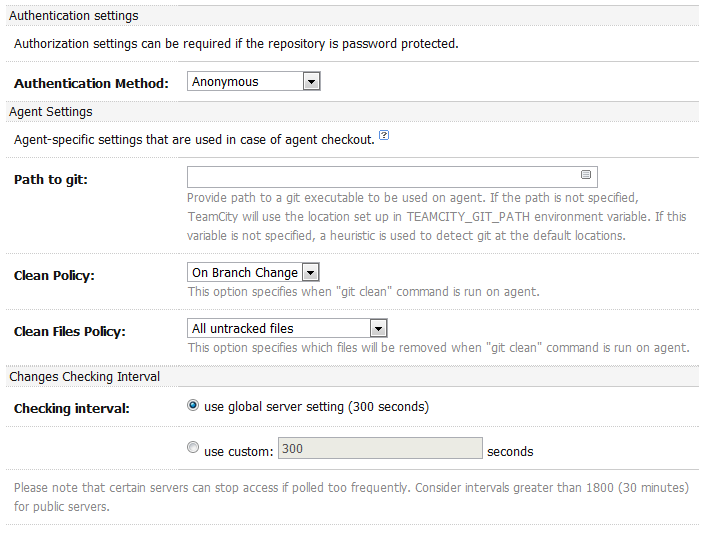
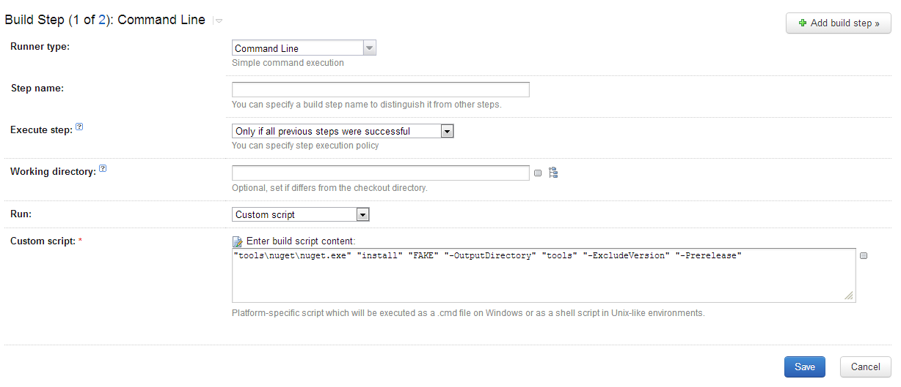

# Compiling TypeScript applications

FAKE can be used to build a variety of different application types. 
In this tutorial we are looking at the TypeScript support.

Consider a greetings.ts file:

    [lang=typescript]
    interface Person {
        firstname: string;
        lastname: string;
     }
     
     function greeter(person : Person) {
         return "Hello, " + person.firstname + " " + person.lastname;
     }

     var user = {firstname: "Jane", lastname: "User"};

     document.body.innerHTML = greeter(user);

## Running the TypeScript compiler

    

You can download the free professional edition of TeamCity from [http://www.jetbrains.com/teamcity/](http://www.jetbrains.com/teamcity/). After the installation process you should be ready to configure your first build.

## Creating a FAKE project on TeamCity

Now create a new project and add a build configuration:

You also need to set the artifacts paths:

## Attach a VCS root

The next step is to attach a VCS root. For this sample we will use the official FAKE repository at [https://github.com/forki/FAKE/](https://github.com/forki/FAKE/).

## Creating the build step

Now is the time to create two build steps. The first one downloads FAKE via Nuget and the second one runs the build script:

If you want you could also add a build trigger to your build script:

## Running the build

Now if everything is configured correctly, you can run your build and the output should look like:

You can also inspect the NUnit results:

